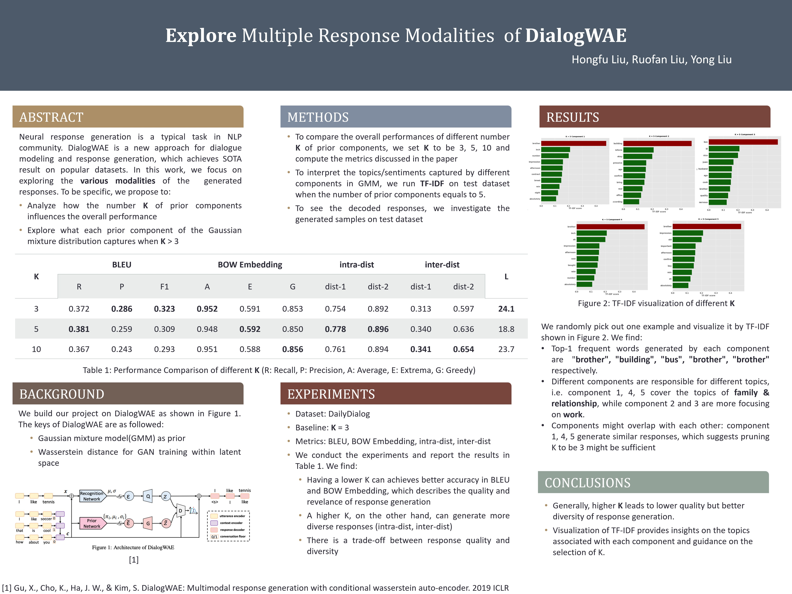

# DialogWAE

This repository is for CS6101, we are investigating this paper: 
[**DialogWAE: Multimodal Response Generation with Conditional Wasserstein Auto-Encoder**](https://arxiv.org/abs/1805.12352). The original repository is https://github.com/guxd/DialogWAE. 

## Poster


## Dependency
 - PyTorch 0.4.0
 - Python 3.6
 - NLTK
 ```
 pip install -r requirements.txt
 ```

## Train
- Use pre-trained Word2vec
  Download Glove word embeddings `glove.twitter.27B.200d.txt` from https://nlp.stanford.edu/projects/glove/ and save it to the `./data` folder. The default setting use 200 dimension word embedding trained on Twitter.

- Modify the arguments at the top of `train.py`

- Train model by
  ```
    python train.py --visual
  ```
The logs and temporary results will be printed to stdout and saved in the `./output` path.

- Visualize the training status in Tensorboard
  ```
    tensorboard --logdir output
  ```

## Evaluation
Modify the arguments at the bottom of `sample.py`
    
Run model testing by:
```
    python sample.py
```
The outputs will be printed to stdout and generated responses will be saved at `results.txt` in the `./output` path.

## TF-IDF

First change models/dialogwae_gmp.py 
```
self.fix_prior_net = MixVariationFixCompo(self.prior_net.input_size, self.prior_net.z_size, self.prior_net.n_components, self.prior_net.gumbel_temp, select_compo=[component number])
```

then run 
```
   python sample.py --selected_compo [0|1|2|3|4]
```

After that, visualize TF-IDF by running TFIDF.ipynb

## References 
```
@inproceedings{gu2018dialogwae,
      title={Dialog{WAE}: Multimodal Response Generation with Conditional Wasserstein Auto-Encoder},
      author={Gu, Xiaodong and Cho, Kyunghyun and Ha, Jung-Woo and Kim, Sunghun},
      journal={arXiv preprint arXiv:1805.12352},
      year={2018}
}
```
